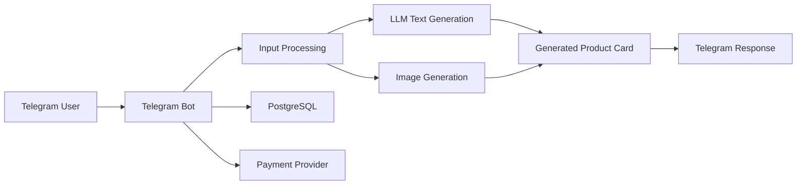

# CardBot

Telegram bot for generating marketplace product cards and AI product images for Wildberries and Ozon sellers.

CardBot turns a short product description and ordinary product photos into a ready-to-use marketplace card: SEO title, description, keywords, characteristics, and product visuals.

## What It Does

The bot helps marketplace sellers create product listings faster by automating the repetitive part of card preparation:

* SEO-optimized product title
* product description
* keyword set
* structured characteristics
* AI-generated product images
* user balance and trial generation logic
* payment flow for paid generations

## Why It Matters

Marketplace sellers often need many product cards, but preparing them manually takes time and requires copywriting, SEO, and visual production.

CardBot is a practical AI product that combines LLM text generation, image generation, Telegram UX, payments, and cost-aware generation logic into one workflow.

The project demonstrates not just an AI prompt, but a full product pipeline: user input, validation, LLM generation, image workflow, payments, balance accounting, and deployment.

## Core Workflow

1. User sends a short product description and product photos.
2. The bot prepares the input for the AI pipeline.
3. LLM generates marketplace content:

   * title
   * description
   * keywords
   * characteristics
4. Image generation model creates product visuals.
5. The bot returns the generated card to the user.
6. Trial or paid generation balance is updated.

## AI Pipeline

CardBot uses a multi-step AI workflow:

* DeepSeek / OpenRouter for structured text generation
* GPT Image for product image generation
* structured output for predictable card fields
* prompt engineering for marketplace-specific SEO format
* vision/image input workflow based on user-uploaded product photos

One of the key optimizations is combining several product photos into a single collage-like model input. This gives the image model more product context while reducing generation cost.

## Product Features

* Telegram bot interface
* product card generation from text and photos
* SEO title, description, keywords, and characteristics
* AI product image generation
* trial generations
* paid generation balance
* payment integration
* generation history
* admin/product configuration through environment variables
* production deployment on VPS

## Architecture

## Stack

* **Language:** Python
* **Bot:** Telegram Bot API
* **Database:** PostgreSQL
* **AI / LLM:** OpenRouter, DeepSeek, GPT Image
* **Payments:** payment provider integration
* **Infrastructure:** Linux VPS, systemd, GitHub Actions
* **Architecture:** async bot workflow, structured generation pipeline, balance/payment logic

## What This Project Demonstrates

* building an AI-powered product end-to-end
* LLM integration in a real user workflow
* AI image generation pipeline
* marketplace/e-commerce automation
* cost-aware AI product design
* Telegram bot UX
* payment and balance logic
* production deployment and operation

## Repository Notes

This repository is part of my public portfolio and demonstrates the product architecture and implementation approach behind CardBot.

Sensitive production credentials, API keys, payment secrets, and environment-specific configuration are not stored in the repository.

## Status

MVP launched as a Telegram bot.

Public bot: [@CaardMakerBot](https://t.me/CaardMakerBot)

## Related Links

* Product / brand: [alterega.ru](https://alterega.ru)
* Author: [OzzY12345](https://github.com/OzzY12345)
